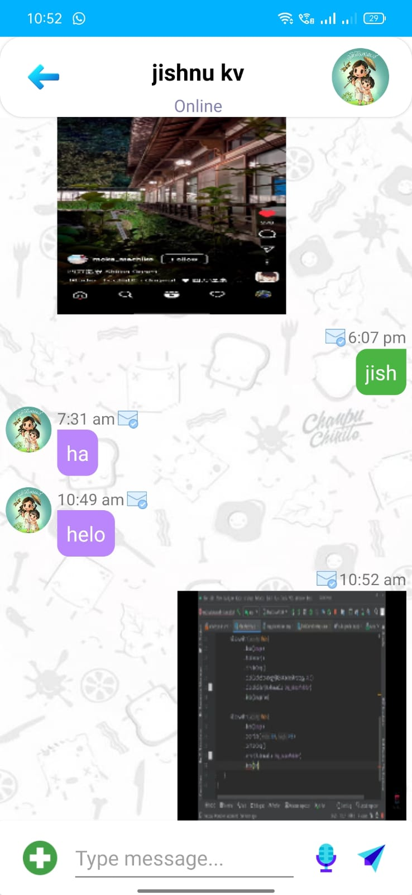
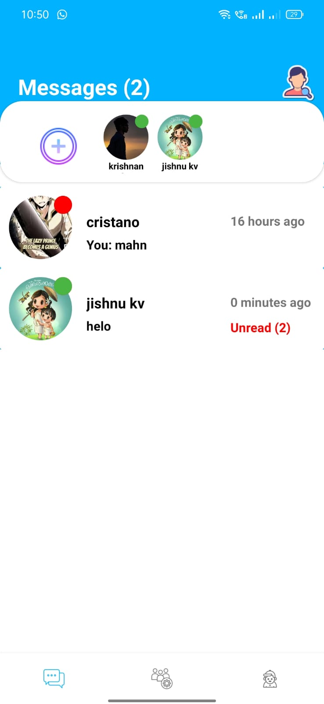
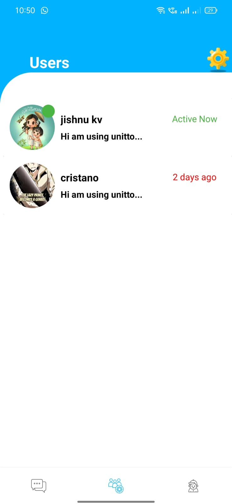
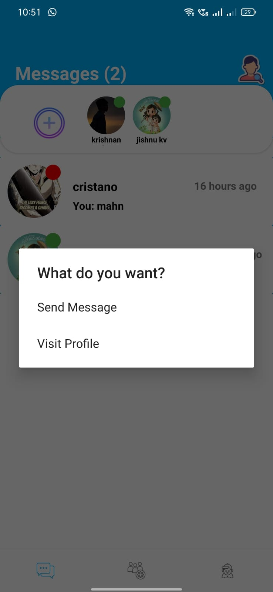
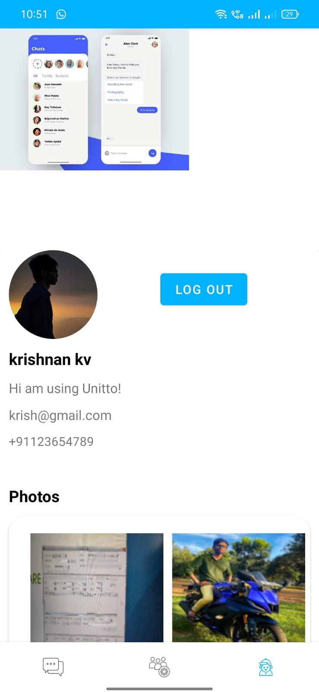

# MessengerApp-Kotlin-Firestore

<h1>Unitto Messenger</h1>

<body>

</body>
</html>

 
 
 

<h2>Features</h2>

<h3># Realtime Messaging</h3>
<h3># Text & Image Messaging</h3>
<h3># View Online and Offline Status</h3>
<h3># Sent , Seen & Received Message Features</h3>
<h3># Shimmer effects added</h3>

 
 
 

<h3>#Note :- The app is in development stage, Further updates will be commited in future</h3>
<h3>For more info: please contact "_krishnan_venugopal_" in Instagram</h3>

